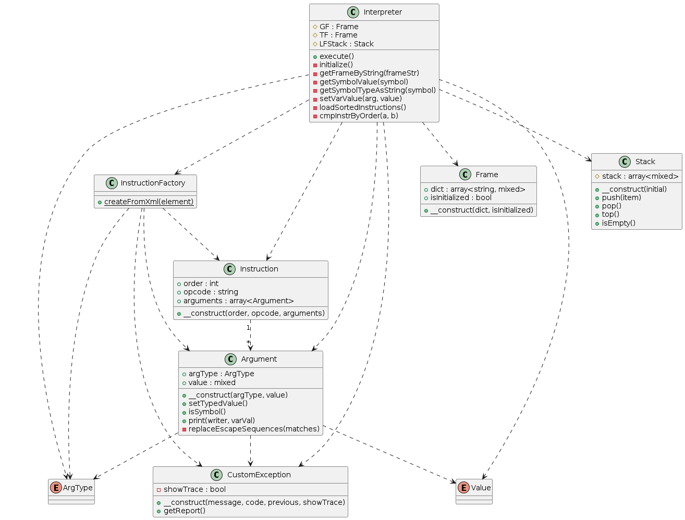

## Implementační dokumentace k 2. úloze do IPP 2023/2024
### Jméno a příjmení: Radek Jestřabík
### Login: xjestr04
Vlastní implementace ve složce /student

## Interní reprezentace

Interpret využívá interní reprezentaci instrukcí a rámců. Instrukce jsou načteny ze vstupního XML souboru a jsou reprezentovány instancemi třídy `Instruction`. Každá instrukce obsahuje svůj operační kód a argumenty a pořadí v rámci programu.
  
Význačnou třídou je také třída `Argument`, která reprezentuje jednotlivé argumenty instrukce. Každý argument má přiřazenou hodnotu a typ z výčtového typu `ArgType`. Typ argumentu umožňuje mít jednu metodu pro práci se všemi typy argumentů a neopakovat kód.
  
Rámce (GF a TF) jsou reprezentovány instancemi třídy `Frame`. Každý rámec obsahuje asociativní pole pro uchování proměnných.
  
Jako zásobník slouží třída `Stack`. Instance této třídy jsou využívány pro ukládání skoků, reprezentaci rámců LF a jako datový zásobník.

## Způsob řešení a návrhu

Vytvořená část programu začíná ve třídě `Interpreter`, v hlavní metodě `execute()`, která provádí interpretaci instrukcí. Na začátku se zinicializují potřebné struktury (rámce a  zásobníky). Následně se pokračuje načtením pole instrukcí pomocí `InstructionFactory`.
  
Před samotnou interpretací se jednou projdou všechny instrukce a hledají se návěští, která se uloží do asociativního pole s názvem jako klíčem a reálným číslem instrukce (ne dle atributu `order`) jako hodnotou. Tímto se umožní při samotné interpretaci skákat na návěští za aktuální instrukcí, která v druhém průchodu zatím nebyla zpracována.
  
Interpretace probíhá pomocí hlavní smyčky, ve kterých jsou zpracovávány jednotlivé instrukce. Interpret také využívá různé pomocné metody, nejčastěji na práci s třídou `Argument`, například pro získávání a ukládání dat do této třídy.

## Návrhový vzor Factory

V interpretu je implementován návrhový vzor Factory pomocí třídy `InstructionFactory`. Tato třída vytváří instance třídy `Instruction` na základě XML elementů z načteného vstupního souboru. Tím je zajištěno oddělení procesu vytváření instrukcí od procesu interpretace.

## UML diagram tříd

